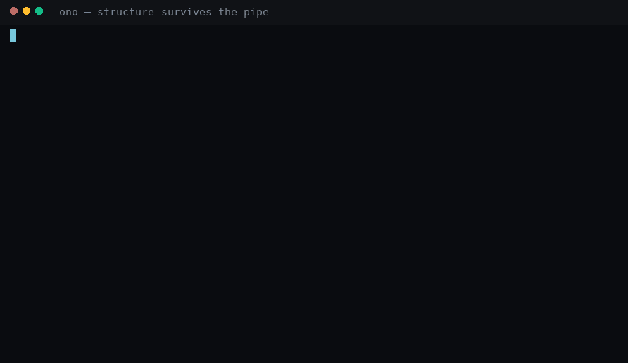
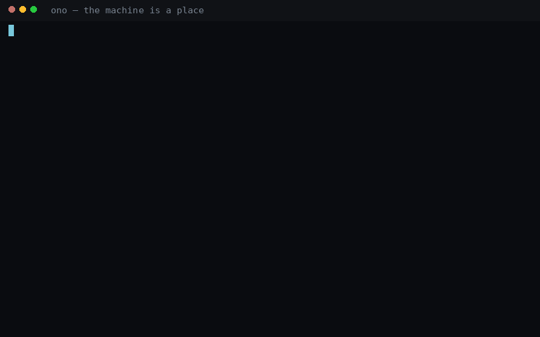
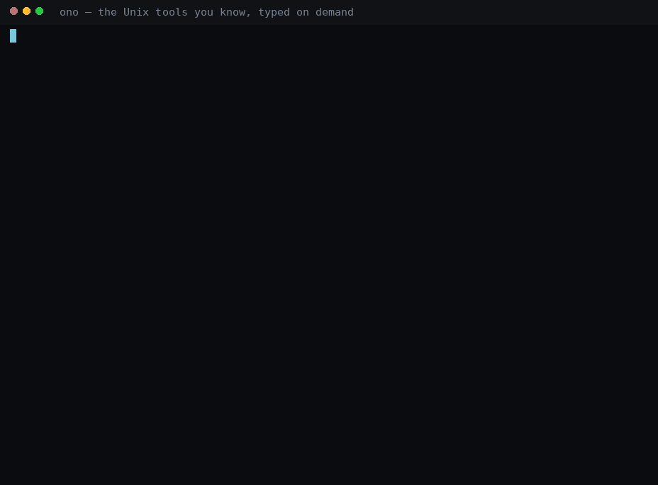

# Ono-Sendai

**A typed, structured Unix shell for people who like machines.**

> *The sky above the port was the color of television, tuned to a dead channel.*
> — William Gibson, *Neuromancer*, 1984

In Gibson's Sprawl, **Ono-Sendai** builds the cyberspace decks — the hardware a console cowboy
jacks into to see the system as it actually is. That is the whole idea here, minus the fiction:

> **Bash is a command interpreter. PowerShell is an object shell. Ono-Sendai is a systems interface.**

The command is `ono`. The deck is real this time.

[**Install**](#installing-it) · [**Quick start**](#quick-start) ·
[**Wiki — the user manual**](https://github.com/godspeed-you/ono-sendai/wiki) ·
[**Releases**](https://github.com/godspeed-you/ono-sendai/releases) ·
[**Philosophy**](PHILOSOPHY.md)

---

## The problem

`ps`, `find`, `tar`, `dd`, `ip`, `systemctl`, `git`, `awk`, `grep` — individually excellent, and
collectively a vocabulary: each has its own grammar, its own flags, its own idea of what a column
is, and you memorise all of it.

And all of them flatten. The kernel *knows* that a process is a process, a socket is a socket, a
service is a service. Then it prints characters, and you rebuild the structure that was already
there with `awk`, `cut`, `sed`, `jq` and regexes that break the day someone adds a column.
Decades of tooling exist to reconstruct information the machine held a moment earlier.

PowerShell proved the fix — objects survive the pipe — and wrapped it in a ceremony Unix people
justifiably bounced off. Ono-Sendai takes the idea seriously and reinterprets it for terminal
culture: terse, composable, and honest about the Unix underneath.

## What it feels like

Values keep their shape all the way down the pipe:

```text
local://~ > get process | sort memory desc | take 3 | select pid name memory

PID      NAME            MEMORY
3647     claude-desktop  3.21 GiB
2573964  rustc           815.52 MiB
1719281  postgres        651.29 MiB
```



That table is a *rendering*. What flows through the pipe is `Stream<Process>` — `memory` is a
quantity with a unit, not the string `3.21 GiB` — so the next stage addresses objects directly:

```text
local://~ > get process | where name == "postgres" | stop process
```

Knowing where a thing lives, or one property of it, is enough to walk there. This finds a web
server before anyone types `nginx`:



And Unix stays underneath, unharmed and first-class:

```text
local://~ > git log --oneline | grep fix
```

Text from foreign programs enters as text, and everything else stays the honest bytes it always
was. The recordings above are the real binary in a clean container; `scripts/demo/make.sh`
rebuilds every frame of them on your machine.

## Why Ono-Sendai?

- **Structured by default, text by choice.** Native commands emit typed values against published
  schemas; rendering is a separate concern from data.
- **Unix remains underneath.** Running an arbitrary executable stays trivial. Always.
- **One language for every domain.** A small grammar and a controlled verb registry — `get`,
  `set`, `where`, `sort`, `enter`, `trace`, `watch`, `link` — instead of thirty dialects.
- **Relationships are first-class**, and they belong to the kernel: `trace` returns the graph a
  provider actually asserted, with provenance, as a value you can pipe.
- **The machine has a geography** — places, exits, a trail, and a search that finds a thing by what
  it *does* rather than by what it is called. Local and remote are the same mental model.
- **Danger is visible before damage**, and uncertainty stays visible: unknown is `null`, never a
  zero and never a plausible default.
- **Discoverability is part of the language.** `help`, completion, `explain`, `inspect` and `type`
  answer from the same registries the shell dispatches on, so they cannot drift.

## Installing it

Requirements: Linux on x86_64 or aarch64, glibc 2.34 or newer (Debian 12, Ubuntu 22.04, Fedora,
RHEL 9 and their relatives).

Each [GitHub release](https://github.com/godspeed-you/ono-sendai/releases) carries a `.deb` and an
`.rpm` for both architectures:

```bash
# Debian, Ubuntu and relatives
sudo apt install ./ono_0.4.0_amd64.deb          # or ono_0.4.0_arm64.deb
# Fedora, RHEL and relatives
sudo dnf install ./ono-0.4.0-1.x86_64.rpm       # or ono-0.4.0-1.aarch64.rpm

chsh -s /usr/bin/ono                             # make it your login shell
```

Or build it, with Rust 1.94+ (`rust-toolchain.toml` pins the toolchain, Cargo picks it up):

```bash
git clone https://github.com/godspeed-you/ono-sendai
cd ono-sendai
cargo build --release -p ono-cli
install -m 0755 target/release/ono ~/.local/bin/ono   # or anywhere on your PATH
```

Configuration lives at `~/.config/ono/config.ono` and is deliberately restricted: it sets values,
functions and aliases, and cannot run commands at startup.

→ Packaging details, uninstalling, `chsh` caveats and building your own packages:
[**Install**](https://github.com/godspeed-you/ono-sendai/wiki/Install) in the Wiki.

## Verifying a release

Every release publishes the SHA-256 digest of every artifact, a keyless Sigstore signature over
that manifest, signed build provenance, and the record of what the build was given. Check them
before you install anything. `cosign` is the one tool you add
([sigstore/cosign](https://github.com/sigstore/cosign)); everything else is coreutils.

```bash
VERSION=0.4.1; ARCH=amd64
BASE=https://github.com/godspeed-you/ono-sendai/releases/download/v$VERSION
curl -fLO $BASE/ono_${VERSION}_${ARCH}.deb
curl -fLO $BASE/SHA256SUMS
curl -fLO $BASE/SHA256SUMS.sigstore.json
curl -fLO $BASE/build-provenance.json
curl -fLO $BASE/build-provenance.json.sigstore.json
```

```bash
cosign verify-blob         --bundle SHA256SUMS.sigstore.json         --certificate-oidc-issuer https://token.actions.githubusercontent.com         --certificate-identity-regexp '^https://github\.com/godspeed-you/ono-sendai/\.github/workflows/release\.yml@refs/tags/v'         SHA256SUMS
```

```bash
sha256sum --check --strict --ignore-missing SHA256SUMS
```

```bash
cosign verify-blob         --bundle build-provenance.json.sigstore.json         --certificate-oidc-issuer https://token.actions.githubusercontent.com         --certificate-identity-regexp '^https://github\.com/godspeed-you/ono-sendai/\.github/workflows/release\.yml@refs/tags/v'         build-provenance.json
grep -o "$(sha256sum ono_${VERSION}_${ARCH}.deb | cut -d' ' -f1)" build-provenance.json
```

```bash
sudo apt install ./ono_${VERSION}_${ARCH}.deb
```

**The order is the point.** The signature over the manifest is verified first, and the artifacts
are checked against the manifest second. Reversed, the sequence proves only that the download was
not corrupted in transit — a manifest an attacker wrote agrees perfectly with the artifacts that
attacker also wrote. And the identity regexp is the whole of the signature check: without it, a
verification accepts a signature from anyone Sigstore has ever issued a certificate to.

The signing is keyless, so the project holds no private signing key and you need no public one —
the bundle carries the signature, the short-lived certificate and the transparency-log entry
together. With this repository checked out, `scripts/verify-release.sh --dir <dir>` runs all three
checks and cross-checks the manifest against the provenance; it is the same script the release
workflow runs on itself before it publishes anything.

**Not yet proven end to end.** No release has been signed: keyless signing needs a token that
exists only inside a run of the release workflow, and verifying one needs Sigstore over a network
the acceptance container does not have. The sequence above is what a reader will run, and the
first `v*` tag is the run that proves it passes.

→ What each step proves and what to do when one fails:
[`docs/reference/release-verification.md`](docs/reference/release-verification.md) ·
[**Install**](https://github.com/godspeed-you/ono-sendai/wiki/Install) in the Wiki.

## Quick start

```bash
ono                                   # a conversation, if stdin is a terminal
ono -c 'get process | where cpu > 20' # one pipeline, then exit
ono script.ono arg1 arg2              # a script, with $args bound
ono --agent                           # the remote end of a link, over stdin/stdout
```

Five things to try, roughly in order of how quickly they change your idea of a shell:

```text
get process | sort memory desc          a typed table — no awk, no column guessing
get process | where pid == 1 | inspect  every field, its type, and where it came from
explain get file /tmp | remove file     what would happen, without it happening
watch process                           the table updates in place; Ctrl-C ends it
find place --where local.port == 8080   the listener, before you know what it is called
```

→ [**First Five Minutes**](https://github.com/godspeed-you/ono-sendai/wiki/First-Five-Minutes)
walks the rest, and
[**Coming from Bash**](https://github.com/godspeed-you/ono-sendai/wiki/Coming-from-Bash)
translates what you already know.

## Unix stays Unix

`ps aux | grep foo` gives you the bytes `ps` writes, byte for byte, and job control, quoting and
signals behave the way your fingers expect. Nothing here asks you to give up the tools you have.

### The Unix tools you already know become typed

When a *typed* consumer follows — `where`, `select`, `sort`, `count`, a table at the terminal — a
first-party adapter rewrites the invocation to the tool's own machine-readable form and decodes it
into the same schemas the native providers use, with the provenance to prove it. Nothing new to
learn, and `explain` shows every step:



```ono
ps aux | where pid == 1 | select pid user name
lsblk | where type == "disk" | select name size
findmnt | where target == "/" | count
ip route | where interface == "lo" | count
ss -tunap | where state == "listen" | count
explain ss -tunap | where state == "established"
raw ps aux | head -3
```

`raw <command>` bypasses the layer unconditionally; `adapt <command>` demands structure and fails
visibly the moment it would have to guess. Text tools (`grep`, `sed`, `awk`, `less`, editors) stay
raw by design.

→ Which tools adapt, at which versions, and what each adapter deliberately leaves behind:
[`docs/reference/adapters/`](docs/reference/adapters/README.md) ·
[**Running Unix Programs**](https://github.com/godspeed-you/ono-sendai/wiki/Running-Unix-Programs).

## Beyond the pipeline

### The machine is a place

The system has a geography, and fourteen commands carry it — `look`, `near`, `enter`, `follow`,
`jump`, `back`, `up`, `home`, `trail`, `find place`, `map`, `map links`, `pin`, `unpin`:

```ono
look
near | take 5
find place --where local.port == 8080
trail
```

Three things stay apart that other tools blur. **Hierarchy and graph are different questions**:
`up` walks where a thing belongs, `back` walks where *you* have been, `follow` walks a
relationship an observer asserted. **Identity outlives the pid**: a place you visited that then
exits becomes a tombstone — visibly dead, still reachable, safe from whoever inherits its number.
And **denied says denied**: a door you may not open renders as a locked door, an empty room as an
empty room.

→ [**Spatial Navigation**](https://github.com/godspeed-you/ono-sendai/wiki/Spatial-Navigation) ·
[**The Map**](https://github.com/godspeed-you/ono-sendai/wiki/The-Map) ·
[**Trace and the Graph**](https://github.com/godspeed-you/ono-sendai/wiki/Trace-and-the-Graph)

### Remote systems are places too

A remote machine is not a second product mode with its own language. It is another place in the
same world, and the prompt says which one you are standing in:

```text
local://~ > link host prod-db
linked prod-db (ssh): process file dir user group env mount interface route socket service

local://~ > enter link prod-db

prod-db://~ > get socket | where state == "listen" | select protocol local.port state

PROTOCOL  PORT  STATE
tcp       5432  listen
```

`get process` answers from the other side with provenance saying which host; `leave` brings you
home. The agent on the far end, the negotiation and the refusal when a host key changes are all
proven offline against a real second process.

→ [**Remote Links**](https://github.com/godspeed-you/ono-sendai/wiki/Remote-Links)

### KUANG/11

The extension runtime is named after the icebreaker Case rides through Straylight's ICE. It loads
analysis programs, providers, lenses, automations and AI assistants into the shell under an
explicit capability model: manifests, declared capabilities, brokered host calls, process
confinement, an audit trail, and a deterministic test host every package must pass. Extensions
contribute real objects and real relationships to the same typed pipeline as native commands — a
plugin that inspects Postgres internals produces `Stream<T>` you can filter and sort like anything
else.

**What the native tier is, exactly.** A native KUANG/11 plugin executes as a process of the Ono
user. Ono limits its brokered capabilities and applies process confinement — resource ceilings,
no-new-privileges, its own session, a sanitized environment, a private working directory, each one
installed before the plugin's first instruction and each one able to refuse the launch. It is not
a complete filesystem or network sandbox: kernel isolation is not part of this tier, so a native
plugin can reach whatever your user account can reach without asking Ono for it. Install native
plugins only from sources you are willing to run as your user account.

> **Ono is the deck. KUANG/11 is the software you load into it.**

→ [**Plugins / KUANG-11**](https://github.com/godspeed-you/ono-sendai/wiki/Plugins-KUANG-11)

## Documentation

**The [Ono-Sendai Wiki](https://github.com/godspeed-you/ono-sendai/wiki) is the user manual.**

New here — [Install](https://github.com/godspeed-you/ono-sendai/wiki/Install) ·
[First Five Minutes](https://github.com/godspeed-you/ono-sendai/wiki/First-Five-Minutes) ·
[Coming from Bash](https://github.com/godspeed-you/ono-sendai/wiki/Coming-from-Bash)

Reference — [Command Index](https://github.com/godspeed-you/ono-sendai/wiki/Command-Index) ·
[Spatial Navigation](https://github.com/godspeed-you/ono-sendai/wiki/Spatial-Navigation) ·
[Remote Links](https://github.com/godspeed-you/ono-sendai/wiki/Remote-Links) ·
[Plugins / KUANG-11](https://github.com/godspeed-you/ono-sendai/wiki/Plugins-KUANG-11) ·
[Troubleshooting](https://github.com/godspeed-you/ono-sendai/wiki/Troubleshooting)

Inside the shell itself: `help`, `help <command>`, `type <pipeline>`, `inspect` and
`explain <pipeline>` — answered from the same registries the reference pages are generated from.

**Project internals** live in the repository:

| | |
|---|---|
| [`docs/reference/`](docs/reference/README.md) | generated reference: every command, verb, target, schema, error, capability |
| [`docs/ono_sendai_shell_spec_v0.2.md`](docs/ono_sendai_shell_spec_v0.2.md) | the immutable base specification, plus the `docs/ono_sendai_*spec_v*.md` enhancements layered on it |
| [`docs/spec/`](docs/spec/) | machine-readable contracts: commands, schemas, verbs, errors, providers |
| [`docs/decisions/`](docs/decisions/) | architecture decision records, including every deliberate spec deviation |
| [`docs/ACCEPTANCE.md`](docs/ACCEPTANCE.md) | what "finished" means, in boxes a script can check |
| [`docs/MIGRATION.md`](docs/MIGRATION.md) | what changes for someone upgrading, version by version |
| [`docs/STATE.md`](docs/STATE.md) | the work board: the release verdict, and the backlog |
| [`HISTORY.md`](HISTORY.md) | how the shell was built, phase by phase |

## Philosophy

Ono-Sendai is designed around a small set of principles: preserve the structure the machine
already has, reveal relationships instead of inventing them, keep uncertainty visible, make danger
visible before damage — and let the machine's real complexity supply the aesthetic. Every effect
in this shell is a side effect of telling the truth about the system.

> **The machine is already strange enough. Reveal it.**

→ [**PHILOSOPHY.md**](PHILOSOPHY.md), including what Ono-Sendai deliberately refuses to do.

## Project status

**Current release: v0.4.0.** All ten phases of the specification are implemented, with the
External Command Adaptation Layer (v0.3) and the Spatial Systems Interface (v0.4) on top of them,
and every box of `docs/ACCEPTANCE.md` is ticked by a named automated proof. Primary platform is
Linux (x86_64 and aarch64). Two further enhancement specifications — the Temporal & Causal
Systems Interface (v0.5) and Prospective Change, Protection & Recovery (v0.6) — are specified but
not yet implemented.

**By the numbers.** These are measured, not typed: `cargo xtask metrics` reads them out of the
tree and the quality gate fails when this block and the repository disagree. `tests` counts test
functions *declared* — what a run actually executed is `cargo test`'s own summary to report, and
the two figures beside it say how many of those tests can announce a skip and how many the
canonical CI environment expects to.

<!-- generated by `cargo xtask metrics`. -->

```text
crates=30
workspace_members=32
tests=3327
tests_that_can_skip=71
expected_ci_skips=3
acceptance_cases=129
adrs=367
command_contract_files=13
commands=193
```

<!-- end generated -->

→ Known issues and the backlog: [open issues](https://github.com/godspeed-you/ono-sendai/issues) ·
detailed implementation status: [`docs/STATE.md`](docs/STATE.md) ·
[What Is Not Built Yet](https://github.com/godspeed-you/ono-sendai/wiki/What-Is-Not-Built-Yet) ·
[release notes](docs/releases/)

## Contributing

Contributions are welcome. Ono-Sendai is developed specification-first and test-first: no
production code without a failing test, the narrative specifications immutable and checksummed,
and anything architectural — or anything that resolves an ambiguity in a specification — recorded
as an ADR in [`docs/decisions/`](docs/decisions/). A capability without a passing acceptance case
is not delivered.

```bash
scripts/gate.sh            # format, lint, test, contract check, docs
scripts/acceptance.sh      # every case against the real `ono` binary, in a container
scripts/release-check.sh   # both, plus the release checklist
```

→ [**CONTRIBUTING.md**](CONTRIBUTING.md) for the workflow, and [`AGENTS.md`](AGENTS.md) for the
full development contract. AI implementation agents should start at [`AGENTS.md`](AGENTS.md).

## Security

Ono-Sendai executes commands, adapts external tools, links to remote hosts and loads extensions.
Report a suspected vulnerability privately, through [GitHub's private vulnerability
reporting](https://github.com/godspeed-you/ono-sendai/security/advisories/new) on this repository,
rather than in a public issue — the tracker is world-readable, so a working reproduction posted
there is a working reproduction handed to everyone running an unpatched shell.

→ [**SECURITY.md**](SECURITY.md): the supported versions, what is protected, what is deliberately
not, and what to expect after a report.

## License

MIT. See [LICENSE](LICENSE).
