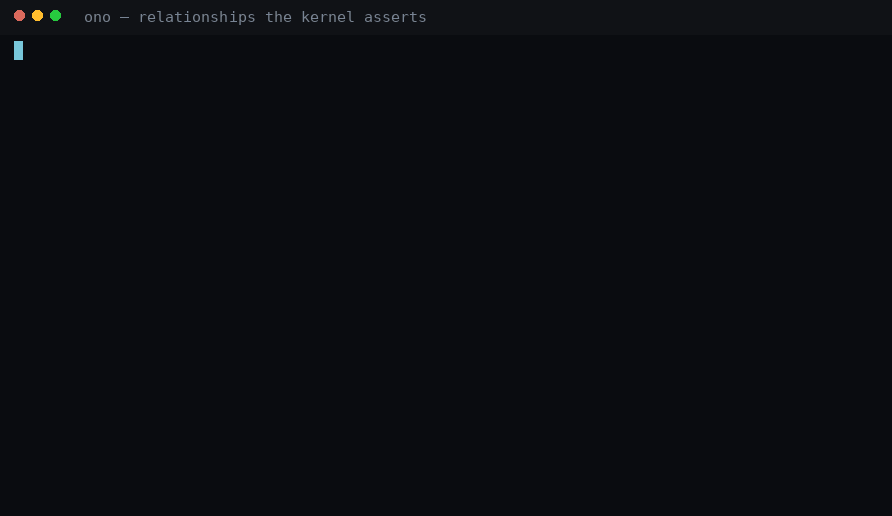

# Ono-Sendai

**A typed, structured Unix shell for people who like machines.**

> *The sky above the port was the color of television, tuned to a dead channel.*
> — William Gibson, *Neuromancer*, 1984

In Gibson's Sprawl, **Ono-Sendai** builds the cyberspace decks — the hardware a console
cowboy jacks into to see the system as it actually is. That is the whole idea here, minus
the fiction:

> **Bash is a command interpreter. PowerShell is an object shell. Ono-Sendai is a systems interface.**

The command is `ono`. The deck is real this time.

> **Status: v0.4.0, released.** All ten phases of the specification are implemented, with the
> External Command Adaptation Layer (v0.3) and the Spatial Systems Interface (v0.4) on top of
> them, and every box of `docs/ACCEPTANCE.md` is ticked by a named automated proof. The quality
> gate parses *and executes* the `ono` examples in this file on every run. The containerised
> acceptance suite — 107 cases against the real binary installed as a login shell, network cut —
> stands at 106 green and one red, which keeps the acceptance job in CI red too: case `152`
> measures `get socket | take 1` at 60 ms on a host with 5 000 sockets, against the 50 ms budget
> of spec §34. The cause is a performance defect — the socket provider reads the whole table
> before it yields the first row. It is named on the board in `docs/STATE.md`, and the case
> stays red until the provider streams.

---

## The problem

`ps`, `find`, `tar`, `dd`, `ip`, `systemctl`, `git`, `awk`, `grep` — individually excellent,
and collectively a vocabulary: each has its own grammar, its own flags, its own idea of what a
column is, and you memorise all of it.

And all of them flatten. The kernel *knows* that a process is a process, a socket is a socket,
a service is a service. Then it prints characters, and you rebuild the structure that was
already there with `awk`, `cut`, `sed`, `jq` and regexes that break the day someone adds a
column. Decades of tooling exist to reconstruct information the machine held a moment earlier.

PowerShell proved the fix — objects survive the pipe — and wrapped it in a ceremony Unix
people justifiably bounced off. Ono-Sendai takes the idea seriously and reinterprets it for
terminal culture: terse, composable, and honest about the Unix underneath.

## What it feels like

Values keep their shape all the way down the pipe:

```text
local://~ > get process | sort memory desc | take 3 | select pid name memory

PID      NAME            MEMORY
3647     claude-desktop  3.21 GiB
2573964  rustc           815.52 MiB
1719281  postgres        651.29 MiB
```


The recording is the real binary in a clean container, and `scripts/demo/make.sh` rebuilds
every frame of it on your machine.

That table is a *rendering*. What flows through the pipe is `Stream<Process>`, so the next
stage addresses objects directly:

```text
local://~ > get process | where name == "postgres" | stop process
```

Unix stays underneath, unharmed and first-class:

```text
local://~ > git log --oneline | grep fix
```

Text from foreign programs enters as text: structure is native where Ono owns the command or
where a program explicitly speaks a structured protocol, and everything else stays the honest
bytes it always was.

### The relationships belong to the kernel

`trace` asks the providers what they can assert about one object — its parent, its children,
the sockets it listens on, the files it holds — and the answer is a graph value that flows
through the pipeline like any other:



### The machine is a place

v0.4 gives the system a geography. Knowing where a thing lives, or one property of it, is
enough to walk there:


That recording finds a web server before anyone types `nginx` — the two acceptance scenarios
behind it carry that as a house rule: every case must discover its object cold, by place and
property alone. Fourteen commands carry the model — `look`, `near`, `enter`, `follow`, `jump`,
`back`, `up`, `home`, `trail`, `find place`, `map`, `map links`, `pin`, `unpin` — and they keep
three things apart that other tools blur:

- **Hierarchy and graph stay separate.** `up` walks where a thing belongs, `back` walks where
  *you* have been, `follow` walks a relationship an observer asserted. An object names one
  canonical parent and keeps every relationship parent, so "where does this belong" and "what
  is it connected to" stay different questions.
- **Identity outlives the pid.** A process is a lifetime descriptor. When two processes answer
  `follow owner`, the shell stops and names them both — you choose. A process you visited that
  then exits becomes a **tombstone**: visibly dead, still reachable through `back`, safe from
  whoever inherits its pid.
- **Denied says denied.** Every group of neighbours carries one of six defined states, so a
  door you may not open renders as a locked door, an empty room renders as an empty room, and
  a reference field a provider left null renders as exactly that.

```ono
look
near | take 5
find place --where local.port == 8080
trail
```

`map` renders the neighbourhood as text into a pipe, as a bounded JSON document when there is
no terminal at all, or as a full-screen view at a real PTY — where `map --live` shows an edge
appear when a connection opens. The focus moves freely; the shell moves on Enter.

### Remote hosts become places

```text
local://~ > link host prod-db
linked prod-db (ssh): process file dir user group env mount filesystem interface route neighbor socket connection service

local://~ > enter link prod-db

prod-db://~ > get socket | where state == "listen" | select protocol local.port state

PROTOCOL  PORT  STATE
tcp       5432  listen

prod-db://~ > trace process 1

process/1 systemd
+-- child -> process/812 postgres
|   +-- connects -> socket/59113
+-- child -> process/401 systemd-journal
```

The prompt is a location URI because you are, in a real sense, somewhere. Inside the frame,
`get process` answers from the other side with provenance saying which host; `leave` brings you
home. `link`, `enter`, `trace`, `watch` — each names exactly what it does. And every one of the
pieces above — the agent on the far end, the negotiation, the mounted providers, the refusals
when a host key changes — is proven offline against a real second process.

## Core ideas

- **Structured by default, text by choice.** Native commands emit typed values; rendering is a
  separate concern from data.
- **Unix remains underneath.** Running an arbitrary executable stays trivial. Always.
- **A predictable language.** A small grammar and a controlled verb registry — `get`, `set`,
  `where`, `sort`, `enter`, `trace`, `watch`, `link` — one dialect for everything.
- **Discoverability is speed.** Completion and help expose the *language*, all the way down.
- **Objects are transparent.** Field names, types, origin and raw values are always inspectable.
- **Errors are values.** Structured, typed, inspectable — with a human rendering on top.
- **Local and remote share one mental model.** The active context is always visible.
- **The machine has a geography.** Places, exits, a trail, an identity that outlives a pid —
  and a search that finds a thing by what it does.
- **Danger is visible before damage.** Privilege, remote targets and destructive scope announce
  themselves in the prompt, while there is still time to stop.
- **No fake intelligence.** The shell never guesses destructive intent from vague text.

## KUANG/11

The extension runtime is named after the Chinese military icebreaker Case rides through
Straylight's ICE — *Kuang Grade Mark Eleven*. It loads analysis programs, providers,
interactive lenses, automations and AI assistants into the shell under an explicit capability
and isolation model: manifests, declared capabilities, sandboxed execution, an audit trail, and
a deterministic test host every package must pass.

> **Ono is the deck. KUANG/11 is the software you load into it.**

Extensions contribute real objects and real relationships to the same typed pipeline as native
commands. A plugin that inspects Postgres internals produces `Stream<T>` you can filter, sort
and pipe like anything else, on equal footing with the native providers.

## House rules for the aesthetic

**Allowed:** terse system vocabulary where the word is *accurate*; live tables whose movement
comes from real events; graph views of real relationships; latency indicators on real links; a
prompt that expresses real location; dark, restrained themes.

**Forbidden by default:** `ACCESS GRANTED` on a successful `ls`. Fake scanning progress. Matrix
rain. Random glitches. Boot animations. Hexadecimal noise. Artificial keystroke delay. Sound
effects. Failure messages written like a video game.

> **The machine is already strange enough. Reveal it.**

A live object stream looks alive because processes are dying in it. A dependency trace feels
like walking into a machine because the edges came from the kernel. The prompt creates a sense
of place because you actually are somewhere. Every effect in this shell is a side effect of
telling the truth about the system — which is also why none of it can be turned into a
screensaver.

## What was built

The build order respected the dependencies, and it ran to the end. Each phase is tagged in git
(`phase-a` … `phase-j`) with the acceptance case that proves it.

| Phase | Delivered |
|---|---|
| **A** ✓ | Language and Unix shell foundation — parser, execution, quoting, jobs, signals |
| **B** ✓ | Value system and native pipelines — the typed stream engine |
| **C** ✓ | Linux core providers — process, file, user, mount, interface, socket, service |
| **D** ✓ | Consistency and discoverability — registries, help, semantic completion, `explain` |
| **E** ✓ | Contextual systems interface — the context stack, `enter`/`leave`, `@`-reuse |
| **F** ✓ | Live system semantics — `watch`, events, in-place tables, native background jobs |
| **G** ✓ | Relationship graph — `trace`, graph values, provenance and confidence |
| **H** ✓ | Remote links — the protocol, the agent, `ono --agent`, capability negotiation |
| **I** ✓ | KUANG/11 extension runtime — broker, audit, SDK, deterministic test host |
| **J** ✓ | Advanced TUI views — `view`, the cursor that sets `@`, only where semantics justify |
| **v0.3** ✓ | External command adapters — `ps`, `ip`, `ss`, `lsblk`, `findmnt`, `lsns`, `stat`, `df`, `find`, `git`, `lsof`, `curl`, `systemctl`, `journalctl` become typed when a typed consumer follows, and stay raw otherwise |
| **v0.4** ✓ | Spatial systems interface — fourteen commands that give the machine a geography: `look`, `near`, `find place`, `enter`, `follow`, `jump`, `back`, `up`, `home`, `trail`, `map`, `map links`, `pin`, `unpin`. Places have an identity that survives pid reuse, a denied neighbourhood is reported as denied, and a linked host is a place with its own root |

Written in Rust — 30 crates, ~2 900 outcome tests, 256 architecture decision records. Latency
is treated as a product feature and *measured* like one, in the container, on every acceptance
run: cold start, parse, and the first rows of `get process` all inside their spec §34 budgets,
with the keystroke-to-render path bounded in the editor's own suite.

## Installing it

Requirements: Linux on x86_64 or aarch64, glibc 2.34 or newer (Debian 12, Ubuntu 22.04,
Fedora, RHEL 9 and their relatives).

Each [GitHub release](https://github.com/godspeed-you/ono-sendai/releases) carries a `.deb` and
an `.rpm` for both architectures. They install `/usr/bin/ono`, the licence and the generated
command reference under `/usr/share/doc/ono/`, and register the shell in `/etc/shells`:

```bash
# Debian, Ubuntu and relatives
sudo apt install ./ono_0.4.0_amd64.deb          # or ono_0.4.0_arm64.deb
# Fedora, RHEL and relatives
sudo dnf install ./ono-0.4.0-1.x86_64.rpm       # or ono-0.4.0-1.aarch64.rpm

chsh -s /usr/bin/ono                             # make it your login shell
```

Every release is installed into fresh Debian and Fedora containers on both architectures
before it is published, as root and as an unprivileged user whose login shell is `ono`
(`scripts/package-check.sh`). Removing the package (`apt remove ono`, `dnf remove ono`)
unregisters the shell again and leaves every account untouched: `chsh` back to another shell
first if `ono` is yours.

To build from source you need Rust 1.94+ (the pinned toolchain in `rust-toolchain.toml` is
picked up automatically):

```bash
git clone https://github.com/godspeed-you/ono-sendai
cd ono-sendai
cargo build --release -p ono-cli
install -m 0755 target/release/ono ~/.local/bin/ono   # or anywhere on your PATH
```

`scripts/package.sh [--target aarch64-unknown-linux-gnu]` builds the same packages locally into
`dist/` (it needs docker, `cross`, `cargo-deb` and `cargo-generate-rpm`).

Configuration lives at `~/.config/ono/config.ono` and is deliberately restricted: it sets
values, functions and aliases, and cannot run commands at startup.

## Running it

```bash
ono                                   # a conversation, if stdin is a terminal
ono -c 'get process | where cpu > 20' # one pipeline, then exit
ono script.ono arg1 arg2              # a script, with $args bound
ono --agent                           # the remote end of a link, over stdin/stdout
```

A dozen things to try, roughly in order of how quickly they change your idea of a shell:

```text
help                                    the whole surface, generated from the registries
get process | sort memory desc          a typed table — no awk, no column guessing
get process | where pid == 1 | inspect  every field, its type, and where it came from
explain get file /tmp | remove file     what would happen, without it happening
watch process                           the table updates in place; Ctrl-C ends it
watch process --every 1s &              …or park it as a job and fg it back later
trace process 1                         the relationship tree the kernel actually asserts
get process | view table                pick a row with the arrows; then:  @ | inspect
enter service nginx                     get process now means that service's processes
look                                    where you are, what the exits are, what is unavailable
find place --where local.port == 8080   the listener, before you know what it is called
trail                                   every move you made, as objects you can pipe
link host prod-db                       remote hosts become places; the prompt says where
```

### The Unix tools you already know become typed

`ps aux | grep foo` gives you the bytes `ps` writes, byte for byte. When a *typed* consumer
follows — `where`, `select`, `sort`, `count`, a table at the terminal — a first-party adapter
rewrites the invocation to the tool's own machine-readable form and decodes it into the same
schemas the native providers use, with the provenance to prove it. There is nothing new to
learn, and `explain` shows every step:


```ono
ps aux | where pid == 1 | select pid user name
lsblk | where type == "disk" | select name size
findmnt | where target == "/" | count
ip route | where interface == "lo" | count
ss -tunap | where state == "listen" | count
explain ss -tunap | where state == "established"
raw ps aux | head -3
```

`raw <command>` bypasses the layer unconditionally; `adapt <command>` demands structure and
fails visibly the moment it would have to guess. Which tools adapt, at which versions, through
which invocations — and what each adapter deliberately leaves behind — is generated from the
contracts into [`docs/reference/adapters/`](docs/reference/adapters/README.md). Text tools
(`grep`, `sed`, `awk`, `less`, editors) stay raw by design.

KUANG/11 packages install as files: a directory under `~/.config/ono/plugins` (or
`$ONO_PLUGIN_PATH`) holding a `manifest.yaml` and its runtime. `get plugin` lists them,
`load plugin <id>` negotiates capabilities before the binary ever starts, and a loaded
package's commands run as `<name>:<command>` in ordinary pipelines.

## Documentation

Everything is in-repo and cross-checked by the gate — the reference pages are *generated* from
the same registries the shell answers `help` from, so they cannot drift:

| | |
|---|---|
| `docs/reference/` | generated reference: every command, verb, target, schema, error, capability |
| `docs/reference/adapters/` | generated: the compatibility matrix and a page per adapter pack — invocations, schemas, limits |
| `docs/ono_sendai_shell_spec_v0.2.md` | the immutable base specification — product, language, KUANG/11 |
| `docs/*_shell_spec_*.md` | enhancement specifications, layered on the base (AGENTS.md §5.2) |
| `docs/spec/` | machine-readable contracts: commands, schemas, verbs, errors, providers |
| `docs/ACCEPTANCE.md` | what "finished" means, in boxes a script can check — all ticked |
| `docs/decisions/` | 40+ architecture decision records, including every deliberate spec deviation |
| `docs/STATE.md` | the work board: the release verdict, and the post-release backlog |
| `docs/assets/` | the recordings in this file, and `scripts/demo/` the tapes that produce them |

And inside the shell itself: `help`, `help <command>`, `type <pipeline>`, `inspect`, and
`explain <pipeline>` — all answered from the same registries the reference pages are generated
from.

## Development

### Verifying it

```bash
scripts/gate.sh            # format, lint, test, contract check, docs
scripts/acceptance.sh      # build a container, run every case against the real `ono` binary
scripts/release-check.sh   # both, plus the release checklist
```

The middle one is the interesting one. It builds a clean Debian image, installs `ono` as the
login shell of an unprivileged user, cuts the network, and asks the binary to prove each
advertised capability against a process table nobody tuned for the test — 107 cases, from "a
person can do ordinary work in ono instead of bash" to hostile filenames, live watches, remote
links against a real child agent, and a KUANG/11 package loaded under the broker. A feature
counts as a feature once it has survived that.

### The recordings

`scripts/demo/make.sh` builds the demo image (`docker/demo.Dockerfile`: the acceptance runtime,
plus one nginx on 8080 and one redis that nobody tuned for the camera), drives the real binary
through the tapes in `scripts/demo/tapes/` over a pty, and renders exactly what the terminal
received, frame by frame, through a small VT emulator in `scripts/demo/render.py`.

```bash
scripts/demo/make.sh                 # every tape, into docs/assets/
scripts/demo/make.sh spatial         # one of them
scripts/demo/make.sh --local         # against target/release/ono, on this machine
```

A tape is the demo's script and nothing else: `run <pipeline>` types a line and waits for the
prompt to come back. What appears between those lines is whatever the shell answered on the
machine it ran on, which is what lets a recording stand as evidence. It needs docker, python3
and pillow.

`scripts/release-check.sh` runs both gates and then the checklist, and prints
`release-check: the shell is release-ready`. That line is the project's definition of done, and
v0.4.0 earned it. It stays unprinted while case `152` is red; making the socket provider stream
is the next thing on the board.

The specification is the source of truth and deliberately more detailed than a pitch: command
metadata, object schemas, error taxonomy, grammar and test matrices are all *derivable* from
it. It is immutable and checksummed — where it was ambiguous or wrong, the deviation is
recorded in an ADR and the document stays exactly as written, so the complete list of
divergences is one grep away.

Development is strictly test-driven and largely agent-driven. `AGENTS.md` is the contract the
agents work under — tests are the referee for whether a goal is reached, and every decision the
spec leaves open is made autonomously and recorded as an ADR. If you are an agent reading this:
your entry point is `AGENTS.md`.

`main` carries the released product together with the specification and the verification
harness; each finished phase is tagged `phase-a` … `phase-j`, and releases are tagged from
`main`. Ongoing implementation work happens on the `implementation` branch and is promoted only
by the user, deliberately, when the release gate passes.

## License

MIT. See [LICENSE](LICENSE).
